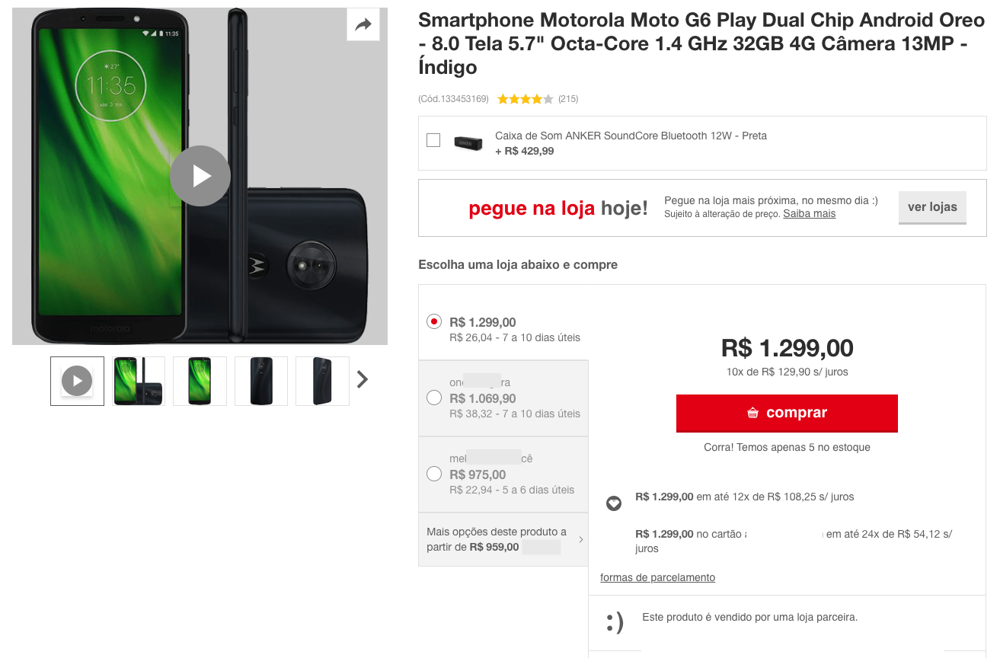
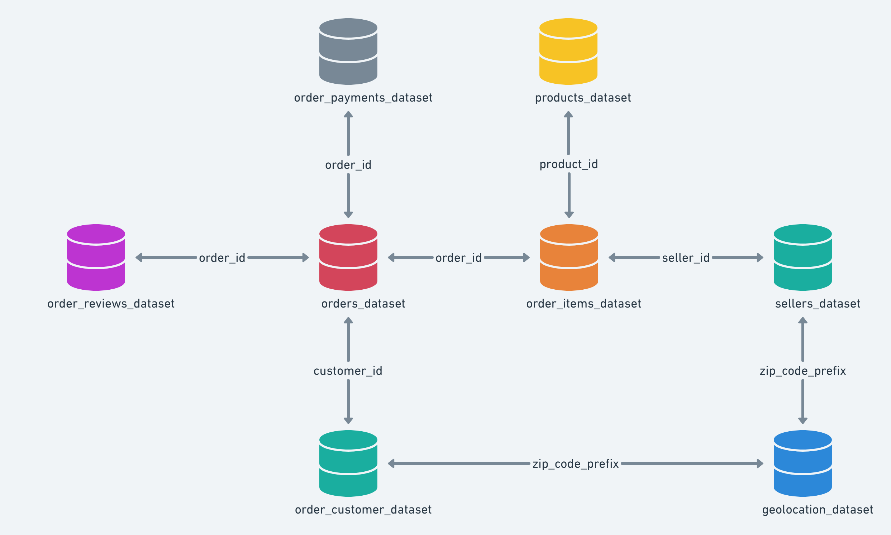

# con-insp-monthly-assignment-ecommerce repo

<a name="readme-top"></a>

<!-- TABLE OF CONTENTS -->
<details>
  <summary>Table of Contents</summary>
  <ol>
    <li><a href="#about-dataset">About Dataset</a></li>
    <li><a href="#data-schema">Data Schema</a></li>
    <li><a href="#challenge">Challenge</a></li>
    <li><a href="#getting-started">Getting Started</a></li>
    <li><a href="#contact">Contact</a></li>
  </ol>
</details>

<!-- ABOUT DATASET -->
## About Dataset

### Brazilian E-Commerce Store Public Dataset 
Welcome! This is a Brazilian ecommerce public dataset of orders made at EStore. The dataset has information of 100k orders from 2016 to 2018 made at multiple marketplaces in Brazil. Its features allows viewing an order from multiple dimensions: from order status, price, payment and freight performance to customer location, product attributes and finally reviews written by customers. There is also a geolocation dataset that relates Brazilian zip codes to lat/lng coordinates.

This is real commercial data, it has been anonymised, and references to the companies and partners in the review text have been replaced with the names of Game of Thrones great houses.

### Context
EStore connects small businesses from all over Brazil to channels without hassle and with a single contract. Those merchants are able to sell their products through the EStore Store and ship them directly to the customers using EStore logistics partners. 

After a customer purchases the product from EStore a seller gets notified to fulfill that order. Once the customer receives the product, or the estimated delivery date is due, the customer gets a satisfaction survey by email where he can give a note for the purchase experience and write down some comments.

### Attention ⚠️
1. An order might have multiple items.
2. Each item might be fulfilled by a distinct seller.
3. All text identifying stores and partners where replaced by the names of Game of Thrones great houses.

### Example of a product listing on a marketplace


<p align="right">(<a href="#readme-top">back to top</a>)</p>

<!-- Data Schema -->
## Data Schema
You can find the eight .csv files in the folder /data inside this repo. The data is divided in multiple datasets for better understanding and organization. Please refer to the following data schema when working with it:



Note: There is a .csv file with the transalations of the product categories from Portuguese to English "data\product_category_name_translation.csv"

<p align="right">(<a href="#readme-top">back to top</a>)</p>

<!-- CHALLENGE -->
## Challenge 
The challenge is to build an end-to-end data engineering and analysis project and share your findings. Dive into the dataset from EStore, explore the rich data, and derive insights on any business aspect that intrigues you. Just be sure to clearly define the business task(s) you are analyzing. Use any tools or environments that suit your workflow better, such as Databricks, VSCode, Jupyter notebooks, Azure Data Factory, Fabric, or other tools to conduct your analysis.

While you're free to select any business task(s) for analysis, below are some examples to spark your ideas. Remember, these are just suggestions, and you're not bound to follow them. 

- <b>Product Quality:</b>
Enjoy yourself discovering the products categories that are more prone to customer insatisfaction.

- <b>Sales Performance:</b> What patterns and influences might be shaping the product sales behavior over the years? How many customers come back to buy products?

- <b>Customer Experience:</b>
Some customers didn't write a review. But why are they happy or mad? Can we uncover the hidden stories behind their satisfaction or dissatisfaction, exploring factors such as delivery times and recurring purchases, to better understand what drives a customer to choose a perfect score or the lowest rating?

- <b>Delivery Performance:</b>
You will also be able to work through delivery performance and find ways to optimize delivery times.

- <b>Feature Engineering:</b>
Create features from this rich dataset or attach some external public information to it (e.g Holidays and Weather data)

#### <u>Suggestions below are more advanced level and require Machine Learning knowledge</u> ⚠️

- <b>Sales Prediction:</b>
With purchase date information you'll be able to predict future sales

- <b>NLP:</b>
This dataset offers an environment to parse out the reviews text through its multiple dimensions.

<p align="right">(<a href="#readme-top">back to top</a>)</p>

<!-- GETTING STARTED -->
## Getting started

#### You should follow the step below to do you analysis:

1. Fork this repository with the EStore data.
2. Clone your forked repo to your preferred workspace (Databricks, VSCode, Jupyter notebooks, Azure Data Factory, Fabric, etc..)
3. Define business task(s)
4. Data Preparation
5. Data Processing
6. Feature Enginering
7. Data Analysis

#### Code snippet for importing a CSV file.
```py
import pandas as pd 
customers = pd.read_csv("data/customers_dataset.csv")
customers.head()
```


<p align="right">(<a href="#readme-top">back to top</a>)</p>


